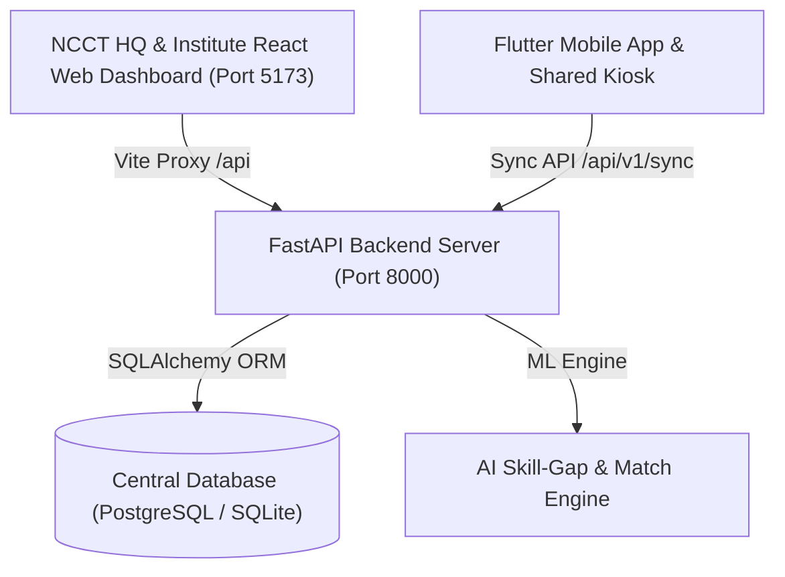

# SahkarSetu AI System Architecture (NCCT HQ Governance Edition)

## Overview
SahkarSetu AI / CoopConnect AI is an AI-enabled cooperative capacity building, ERP training, and employment ecosystem. It features an **NCCT Headquarters Governance Layer** overseeing **20 Regional Institutes of Cooperative Management (RICMs / ICMs)** across India.

## Layered System Architecture

1. **Presentation Layer**:
   - **NCCT National Dashboard (`/hq/*`)**: React 18, Tailwind CSS, Lucide icons, glassmorphic analytics cards.
   - **Institute Portal (`/dashboard`)**: Role-tailored views for Institute Admins, Trainers, and Employers.
   - **Shared Kiosk (`/kiosk`)**: Biometric/QR tablet interface for offline cooperative members.

2. **API & Scope Enforcement Layer**:
   - **FastAPI Core (`app/main.py`)**: Asynchronous Python API.
   - **Scope Guards (`app/api/deps.py`)**:
     - `require_hq_role`: Enforces NCCT HQ governance rights.
     - `require_institute_role`: Enforces institute-level access.
     - `verify_institute_scope`: Enforces multi-tenant `institute_id` isolation.
     - `verify_trainee_self_scope`: Enforces trainee privacy.

3. **Data & Multi-Tenancy Layer**:
   - Central database schema linking all entities to `institute_id`.
   - Audit trail tracking all national administrative actions.
