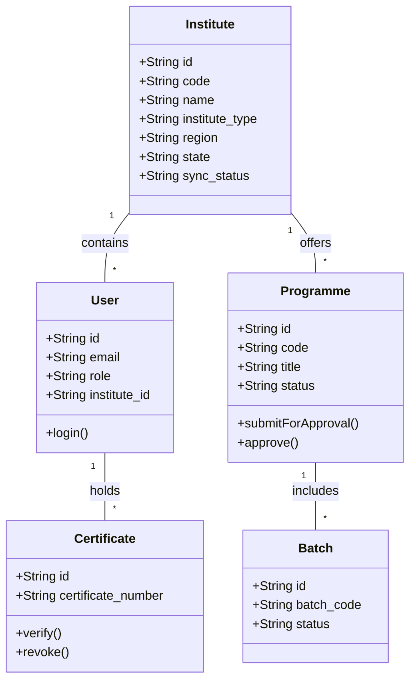

# Class Diagram - NCCT Governance Layer

```mermaid
classDiagram
    class Institute {
        +String id
        +String code
        +String name
        +String institute_type
        +String region
        +String state
        +String sync_status
    }

    class User {
        +String id
        +String email
        +String role
        +String institute_id
        +login()
    }

    class Programme {
        +String id
        +String code
        +String title
        +String status
        +submitForApproval()
        +approve()
    }

    class Batch {
        +String id
        +String batch_code
        +String status
    }

    class Certificate {
        +String id
        +String certificate_number
        +verify()
        +revoke()
    }

    Institute "1" -- "*" User : contains
    Institute "1" -- "*" Programme : offers
    Programme "1" -- "*" Batch : includes
    User "1" -- "*" Certificate : holds
```
