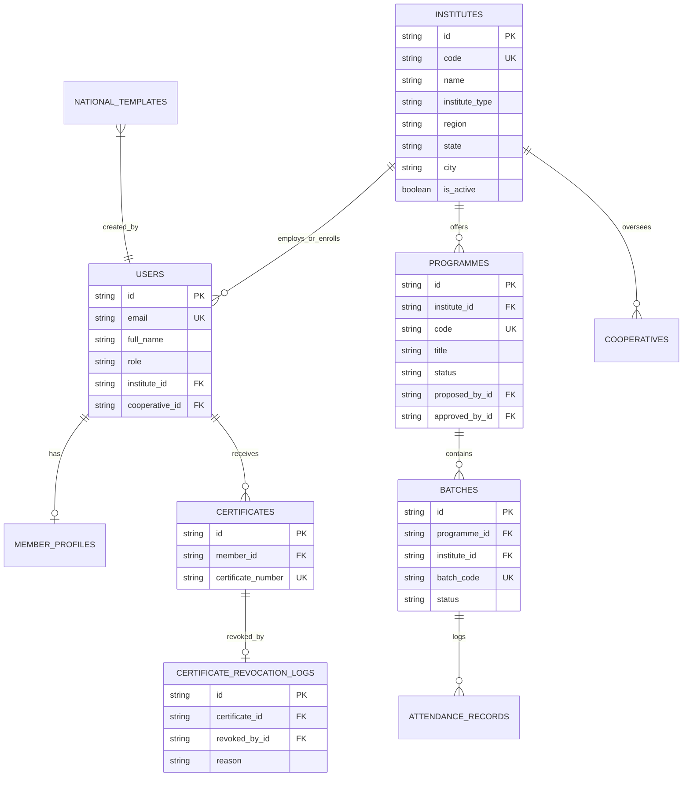

# Entity Relationship Diagram (ERD) - NCCT Governance Edition

```mermaid
erDiagram
    INSTITUTES ||--o{ USERS : employs_or_enrolls
    INSTITUTES ||--o{ PROGRAMMES : offers
    INSTITUTES ||--o{ COOPERATIVES : oversees
    PROGRAMMES ||--o{ BATCHES : contains
    BATCHES ||--o{ ATTENDANCE_RECORDS : logs
    USERS ||--o| MEMBER_PROFILES : has
    USERS ||--o{ CERTIFICATES : receives
    CERTIFICATES ||--o| CERTIFICATE_REVOCATION_LOGS : revoked_by
    NATIONAL_TEMPLATES }|--|| USERS : created_by

    INSTITUTES {
        string id PK
        string code UK
        string name
        string institute_type
        string region
        string state
        string city
        boolean is_active
    }

    USERS {
        string id PK
        string email UK
        string full_name
        string role
        string institute_id FK
        string cooperative_id FK
    }

    PROGRAMMES {
        string id PK
        string institute_id FK
        string code UK
        string title
        string status
        string proposed_by_id FK
        string approved_by_id FK
    }

    BATCHES {
        string id PK
        string programme_id FK
        string institute_id FK
        string batch_code UK
        string status
    }

    CERTIFICATES {
        string id PK
        string member_id FK
        string certificate_number UK
    }

    CERTIFICATE_REVOCATION_LOGS {
        string id PK
        string certificate_id FK
        string revoked_by_id FK
        string reason
    }
```
