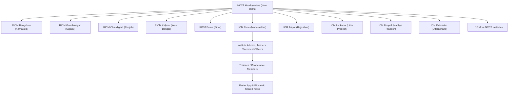
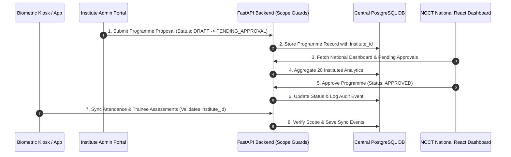
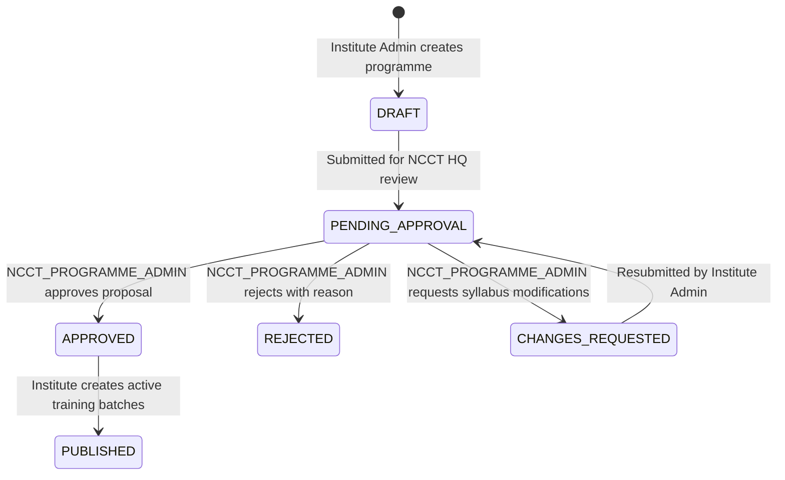

# NCCT Headquarters Governance Extension

The **NCCT Headquarters (HQ) Governance Layer** extends SahkarSetu AI / CoopConnect AI to add national-level oversight, analytics, multi-tenant institute isolation, programme approval workflows, and centralized certificate governance across **20 Regional & State Institutes of Cooperative Management (RICMs / ICMs)** across India.

---

## 1. Hierarchy & Architecture



---

## 2. Central Data Flow Diagram



---

## 3. Role & Scope Access Control

```mermaid
graph LR
    subgraph NCCT HQ Governance
        S1["NCCT_SUPER_ADMIN"] -->|Full National Scope| DB[Central DB]
        S2["NCCT_PROGRAMME_ADMIN"] -->|Approvals & Syllabus| DB
        S3["NCCT_ANALYTICS_OFFICER"] -->|Read-Only National Metrics| DB
        S4["NCCT_CERTIFICATE_AUTHORITY"] -->|Verify & Revoke Certificates| DB
        S5["NCCT_AUDITOR"] -->|Security Audit Trail| DB
    end

    subgraph 20 Institute Level (Multi-Tenant Isolated)
        I1["INSTITUTE_ADMIN"] -->|Scope: institute_id| InstDB[Institute Data Only]
        I2["TRAINER"] -->|Scope: assigned batches| InstDB
        I3["TRAINEE"] -->|Scope: self profile| InstDB
        I4["KIOSK_OPERATOR"] -->|Scope: kiosk institute_id| InstDB
    end
```

---

## 4. Programme Approval Workflow



---

## 5. Summary of Added HQ API Endpoints

| Method | Endpoint | Description | Guard |
| :--- | :--- | :--- | :--- |
| `GET` | `/api/v1/hq/dashboard` | National 20 institutes consolidated metrics | `require_hq_role` |
| `GET` | `/api/v1/hq/institutes` | List all 20 NCCT Training Institutes | `require_hq_role` |
| `POST` | `/api/v1/hq/institutes` | Register a new institute | `require_hq_role` |
| `GET` | `/api/v1/hq/programme-approvals` | National programme approval queue | `require_hq_role` |
| `PATCH` | `/api/v1/hq/programme-approvals/{id}` | Approve / Reject / Request changes | `require_hq_role` |
| `GET` | `/api/v1/hq/national-calendar` | National calendar across 20 institutes | `require_hq_role` |
| `GET` | `/api/v1/hq/analytics` | Comparative institute analytics | `require_hq_role` |
| `GET` | `/api/v1/hq/reports` | Consolidated reporting engine | `require_hq_role` |
| `GET` | `/api/v1/hq/certificates` | Central certificate registry | `require_hq_role` |
| `POST` | `/api/v1/hq/certificates/{id}/revoke` | Revoke certificate with reason | `require_hq_role` |
| `GET` | `/api/v1/hq/certificates/verify/{no}` | Public QR code verification endpoint | Public |
| `GET` | `/api/v1/hq/audit-logs` | National security & operation logs | `require_hq_role` |
